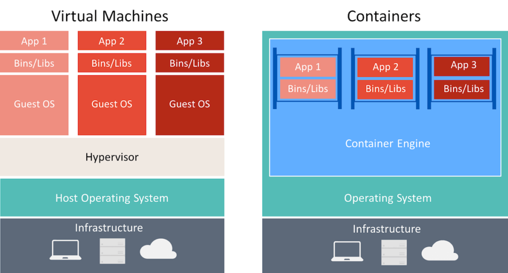
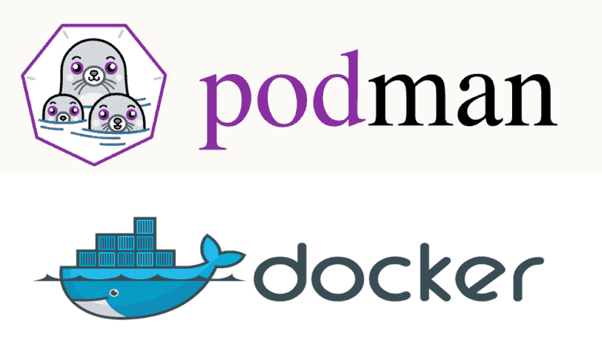

<html>
  <head>
    <body>
      <h1>What is Containerization?</h1>
      

 
       
       

      

      <h3> Container is a modern method of packaging and running software applications in a lightweight, portable, and consistent way. Instead of just writing code and hoping it works the same everywhere, containerization helps you bundle your application with everything it needs — like libraries, dependencies, and configuration files — into a single package called a container.</h3>

       
       
    

      <h1>Which Tool Used To Makes Container :-</h1>
      <h4>(Many Tools availabe in industry used to make contianers but 2 tool is most popular tools) </h4>
      <h2>Docker and Podman :--</h2>

  </head>
</html>
